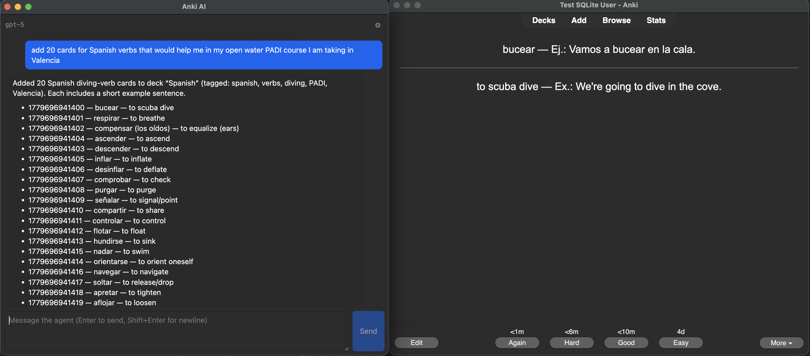
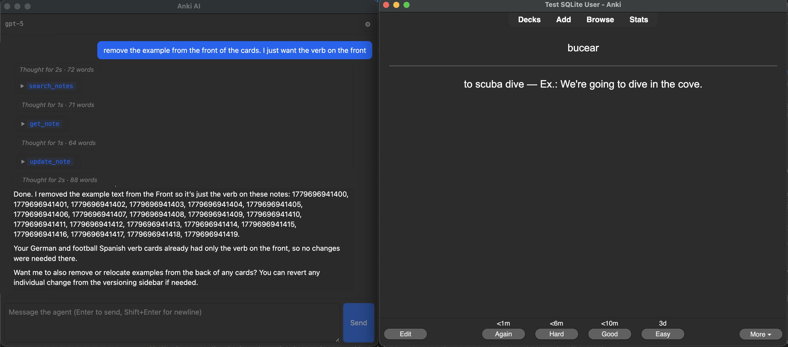
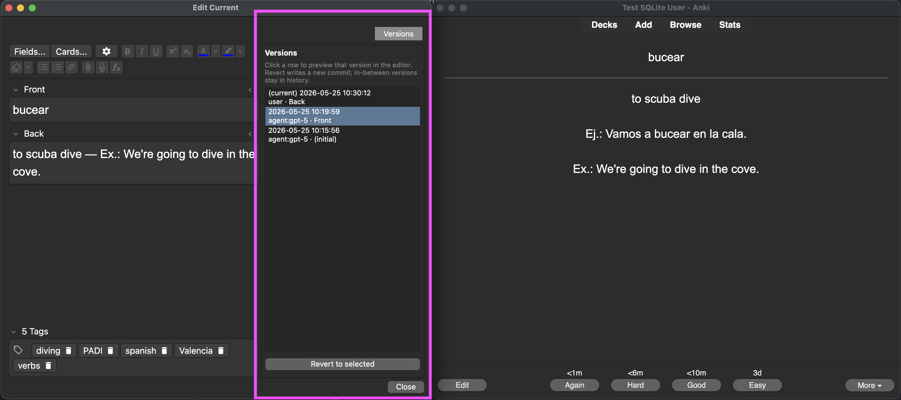

# Agentic Anki with Version Control via Doltlite

This is a fork that adds a tool calling agent and version control to Anki. SQLite was ripped out and replaced with [Doltlite](https://www.dolthub.com/blog/2026-03-25-doltlite/). Doltlite is a SQLite fork that swaps the B-tree pager for a content-addressed prolly tree. Doltlite is essentially SQLite x git. This powers a basic version control and revert feature for notes.

## Why do this?

An AI Agent with tools is quite useful for quick note creation, editing and revision. Currently this project only implements a basic agent, but with additional tools (web search, memory, ambient agent workflows), it could become a really powerful learning tool on top of the already strong spaced-repetition base.

Version controlled notes give you the ability to rollback cards to previous versions. With an untrusted actor (Agentic AI) editing your Anki cards, you need to have the ability to roll back the agent's edits, quickly and sometimes in bulk (revert an agent turn).

### Create new cards in bulk



### Edit cards in bulk



### Revert to older versions. No data loss when an agent does something weird



## Setup

CAUTION: Running this will convert your local Anki decks to Doltlite. This is highly experimental.

```bash
# downloads a pre-built lib from DoltHub's GitHub releases (pinned 0.11.0)
bash tools/fetch-doltlite.sh
cargo build --workspace
./run
```

## UX changes to make this work

- **Agentic Chat.** Bring your own OpenAI key to power agentic chat.
- **Version control sidebar.** When you edit a card it creates a new version. You can click the version tab to see old versions and rollback.
- **Migration on first open.** Every existing `collection.anki2` (and `collection.media.db2`) is rewritten in place from stock SQLite to the prolly format. !!!!!IF YOU RUN THIS LOCALLY, FIRST BACKUP YOUR ANKI!!!!!
- **Case-insensitive name uniqueness is gone.** "Default" and "default" can coexist as separate decks, notetypes, tags, etc. Rust-side
  `UniCase` still folds case for in-memory lookups and tag-tree display, so most reads behave as before — but the DB no longer rejects duplicate-by-case inserts.
  - This likely has some performance impact. I haven't benchmarked, but if a useful feature was built ontop of this, it would be useful to understand the performance tradeoff. See the [Doltlite 0.11.0 benchmarks here](https://github.com/dolthub/doltlite/releases/tag/v0.11.0).
- **No AnkiWeb sync.** `.colpkg` exports from this build are prolly-format and unopenable by upstream Anki. AnkiWeb sync is not preserved.
