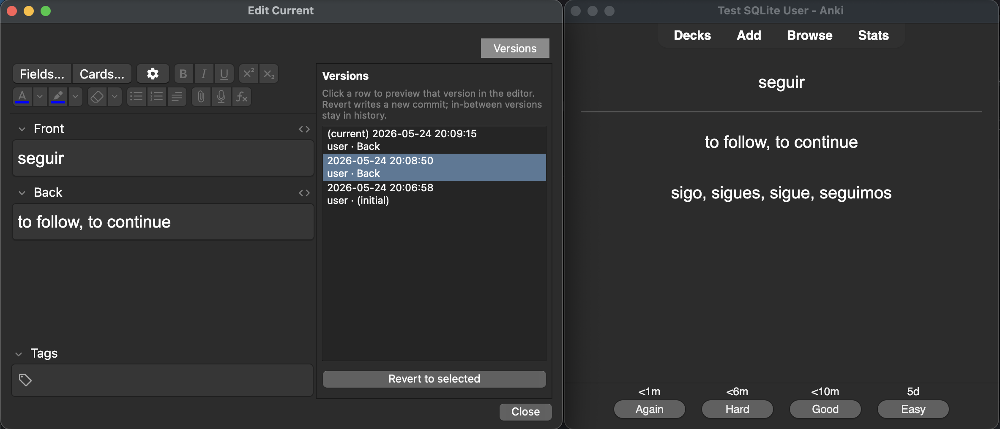

# Version Controlled Anki with Doltlite

This is a fork that adds version control to Anki. SQLite was ripped out and replaced with [Doltlite](https://www.dolthub.com/blog/2026-03-25-doltlite/). Doltlite is a SQLite fork that swaps the B-tree pager for a content-addressed prolly tree. Doltlite is essentially SQLite x git. This powers a basic version control and revert feature for notes.

## Why do this?

Version controlled notes give you the ability to rollback cards to previous versions. Imagine you have an untrusted actor editing your Anki cards (like an AI Agent), you would want to have the ability to roll back the agent's edits. This is the basis to implement this.



## Setup

CAUTION: Running this will convert your local Anki decks to Doltlite. This is highly experimental. It adds little to the user experience and I don't recommend running it to use regularly.

```bash
# downloads a pre-built lib from DoltHub's GitHub releases (pinned 0.11.0)
bash tools/fetch-doltlite.sh
cargo build --workspace
./run
```

## UX changes to make this work

- **Version control sidebar.** When you edit a card it creates a new version. You can click the version tab to see old versions and rollback.
- **Migration on first open.** Every existing `collection.anki2` (and `collection.media.db2`) is rewritten in place from stock SQLite to the prolly format. !!!!!IF YOU RUN THIS LOCALLY, FIRST BACKUP YOUR ANKI!!!!!
- **Case-insensitive name uniqueness is gone.** "Default" and "default" can coexist as separate decks, notetypes, tags, etc. Rust-side
  `UniCase` still folds case for in-memory lookups and tag-tree display, so most reads behave as before — but the DB no longer rejects duplicate-by-case inserts.
  - This likely has some performance impact. I haven't benchmarked, but if a useful feature was built ontop of this, it would be useful to understand the performance tradeoff. See the [Doltlite 0.11.0 benchmarks here](https://github.com/dolthub/doltlite/releases/tag/v0.11.0).
- **No AnkiWeb sync.** `.colpkg` exports from this build are prolly-format and unopenable by upstream Anki. AnkiWeb sync is not preserved.

## How is works

| Concern              | Approach                                                                                                                                                                                                                                                                                                                                                                                                                          |
| -------------------- | --------------------------------------------------------------------------------------------------------------------------------------------------------------------------------------------------------------------------------------------------------------------------------------------------------------------------------------------------------------------------------------------------------------------------------- |
| FFI                  | Pre-built `libdoltlite.a` from DoltHub's GitHub releases, staged under `rslib/doltlite-sys/lib/` and linked via the standard `libsqlite3-sys` env-var redirect (`.cargo/config.toml`). No spoof crate, no patched bindings.                                                                                                                                                                                                       |
| Engine activation    | The prolly engine ships as object files that self-register via `sqlite3_auto_extension`. `build/doltlite_force_load.rs` emits per-platform whole-archive linker flags from every crate that produces a binary or cdylib that links `rslib`.                                                                                                                                                                                       |
| Migration            | `rslib/src/storage/migrate_from_sqlite.rs` detects the file format from the first 16 bytes (`CTLD` vs `SQLite format 3`), copies the file to a scratch path, strips `COLLATE unicase` and `--` line comments from the stored DDL via `PRAGMA writable_schema`, then replays sanitized DDL into a fresh prolly DB and row-copies every user table `ORDER BY` primary key (prolly's planner refuses bare scans on `WITHOUT ROWID`). |
| Pragma compatibility | `is_prolly_engine()` runs `SELECT doltlite_engine()` at open; B-tree-only pragmas (`journal_mode`, `locking_mode`, `page_size`, `legacy_file_format`, `wal_checkpoint`) are skipped on prolly.                                                                                                                                                                                                                                    |
| Qt UX                | `AnkiQt._loadCollection` peeks the first 16 bytes; if the file is still SQLite-format it wraps the open call with `mw.progress.start(label=tr.qt_misc_converting_collection())`. Already-migrated files skip the migration.                                                                                                                                                                                                       |
| Tests                | 294 pass, 35 marked `#[ignore]` (unicase casualties + 2 sync round-trips, both explicitly out of scope). `migrate_real_legacy_file` is the end-to-end check: synthesize a stock SQLite fixture via the system `sqlite3` CLI, migrate, confirm CTLD magic + prolly engine + data round-trip including a `WITHOUT ROWID` table.                                                                                                     |
